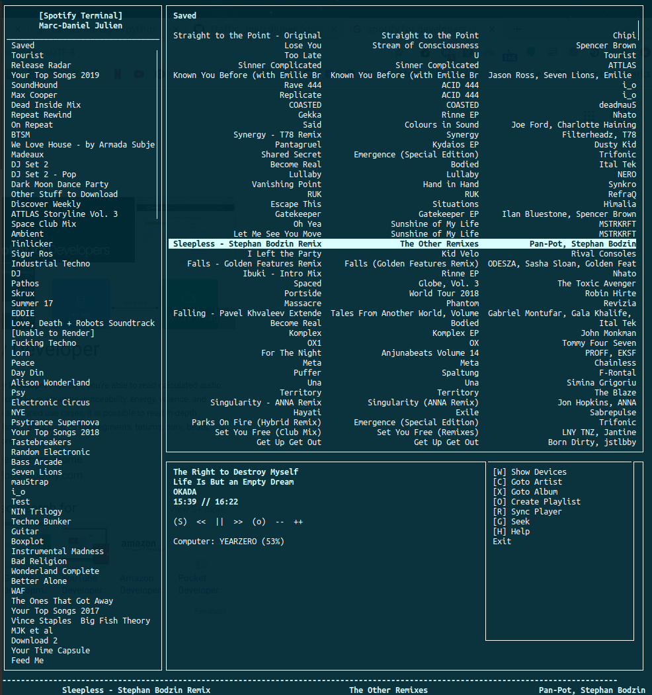

# Spotify Terminal
Terminal program to play/control music via Spotify. Some features require a Spotify Premium account.



# Install
Requires Python 3. Older versions can be manually installed for Python 2 (See releases: https://github.com/marcdjulien/spotify-terminal/releases)
```
pip install spotify-terminal
```
Or clone/download this repository and run:
```
python setup.py install 
```

This application uses Unicurse: https://pypi.org/project/UniCurses
(A version of this already comes with the checkout)


# Usage
Execute the following command to run the program:
```
spotify-terminal.py [-u username]
```
Optional: ```username``` is either the email associated with your Spotify account or the user id.

# ? Search
By typing ```?``` you can begin a search..

# : Commands
By typing ```:``` you can enter commands. The following is a list of all commands:

```search [query]``` | Search for an Artist, Album or Song.

```find [index] [query]``` | Find an entry in the currently list that contains *query*. The UI will automatically go to the *index* found entry.

```volume [0-100]``` | Set the volume.

```play``` | Start playing.

```pause``` | Pause the player.

```repeat [off|context|track]``` | Set the repeat mode.

```shuffle [True|False]``` | Set the shuffle mode.

```exit``` | Exit the application.

# Other Tips and Tricks
```TAB``` while on an artist's page to toggle between their main page and a list of all of their tracks. This is useful if you want to listen to all tracks by an artist within the same context.

```/``` is a shortcut to the ```find``` command. You can also type ```n``` or ```p``` to find a next or previous entry (similar to vim).

```:q``` to exit.

```Backspace``` to cycle through previous track listings.

```Shift + S``` on any track to immediately go to the album page.

```Shift + D``` on any track to immediately go to the artist page.

```Shift + |``` to immediately go to the context of the currently playing song.

```Shift + X``` to immediately go to the album page of the currently playing song.

```Shift + C``` to immediately go to the artist page of the currently playing song.

```Shift + R``` to re-sync the player.

```Shift + >``` to play the next song.

```Shift + <``` to play the previous song.

```Shift + W``` to see list of your devices.

```Shift + 0-9``` to set to set the volume. 1...0 for volume 10...100.

```Shift + ` ``` to mute.

```Shift + P ``` to add a song to a playlist.

```Shift + O ``` to create a new playlist.

```DELETE``` to delete a playlist or song from a playlist.

# Notes
This has only been tested on Linux and Windows with a Spotify Premium account. Briefly on Mac. Feel free to submit pull requests or tickets for issues.
